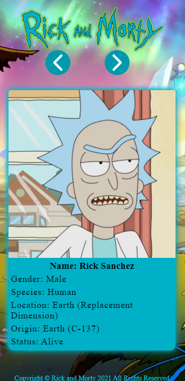

# Rick and Morty Application

#### Rick and Morty is an American adult animated science fiction sitcom created by Justin Roiland and Dan Harmon for Cartoon Network's nighttime programming block, Adult Swim. The series follows the misadventures of cynical mad scientist Rick Sanchez and his good-hearted, but fretful grandson Morty Smith, who split their time between domestic life and interdimensional adventures.

---

---

#### This is an application displaying information about Rick and Morty and other characters from the show.

---

## Technologies Used:

- ### HTML

- ### Cascading Style Sheet(CSS)
- ### JavaScript

- ### jQuery

- ### jQuery Slick Plugin [http://kenwheeler.github.io/slick/]

- ### Rick and Morty API [https://rickandmortyapi.com/documentation/#rest]

- ### Site hosted deployed with Github Pages and Namecheap

# Screenshots

### Title

## 

### Desktop

## 

### Mobile

## 

### Deployed

## 

### Background image

## 

---

[Click here](http://tyronecartwright.com) to see deployed Project

## Future Enhancements

- Implement a navigation menu that allows a user - to select

### Characters

- select an individual character.

### Watch

- Ability to list episodes and playable clips.
